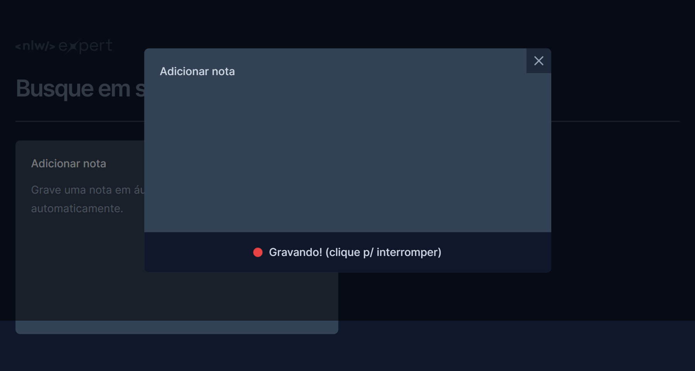

<h1 align="center">Note Experts - Portfólio</h1>

  <a href="#-tecnologias">Tecnologias</a>&nbsp;&nbsp;&nbsp;|&nbsp;&nbsp;&nbsp;
  <a href="#-projeto">Projeto</a>&nbsp;&nbsp;&nbsp;|&nbsp;&nbsp;&nbsp;
  <a href="#memo-licença">Licença</a>

  

 

  <!-- Adicione uma imagem representativa do seu projeto -->
  

## 🚀 Tecnologias Utilizadas

Esse projeto foi desenvolvido com as seguintes tecnologias:

- React: Biblioteca JavaScript para a construção de interfaces de usuário.
- TypeScript: Superset do JavaScript que adiciona tipagem estática ao código.
- Vite: Build tool para projetos modernos de front-end.
- Tailwind CSS: Uma estrutura de design-first sem opiniões para o desenvolvimento web.
- Lucide: Biblioteca para ícones vetoriais.
- Sonner Radix UI: Biblioteca de componentes UI acessíveis.

## 📑 Estrutura do Projeto

- A estrutura do projeto está organizada da seguinte forma:

- src/components: Componentes React reutilizáveis.

## 💻 Projeto

Bem-vindo ao portfólio do Note Experts! Apresento com entusiasmo o meu projeto mais recente, desenvolvido utilizando React, TypeScript, Vite, Tailwind CSS, Lucide e Sonner Radix UI. O Note Experts é uma aplicação para transcrever texto para áudio, onde você pode adicionar uma nota através de digitação ou áudio, além de poder apagar e salvar as notas no localStorage. A barra de busca permite buscar pelas notas adicionadas.

## ⚙️ Funcionalidades

- Transcrição de Texto para Áudio: O Note Experts permite que você insira texto e o converta em áudio.
- Adição e Remoção de Notas: Você pode adicionar notas através de digitação ou áudio, e também apagar as notas existentes.
- Persistência de Dados: As notas são salvas no localStorage para que você possa acessá-las posteriormente.
- Busca de Notas: A barra de busca facilita encontrar notas específicas.

## ❣️ Contribuição

Sinta-se à vontade para contribuir com melhorias, correções de bugs ou novas funcionalidades. Abra uma issue para discutir ideias e sugestões, ou envie um pull request.

Esperamos que o Note Experts seja útil para transcrever texto para áudio de forma eficiente e organizada. Se tiver alguma dúvida ou sugestão, não hesite em entrar em contato. Aproveite o desenvolvimento!

## 🔗 Preview

  <a href="link-do-seu-projeto" target="_blank">Ver o Note Experts</a>

## :memo: Licença

Esse projeto está sob a licença MIT.

---

Feito com ♥ by Seu Nome :wave:
